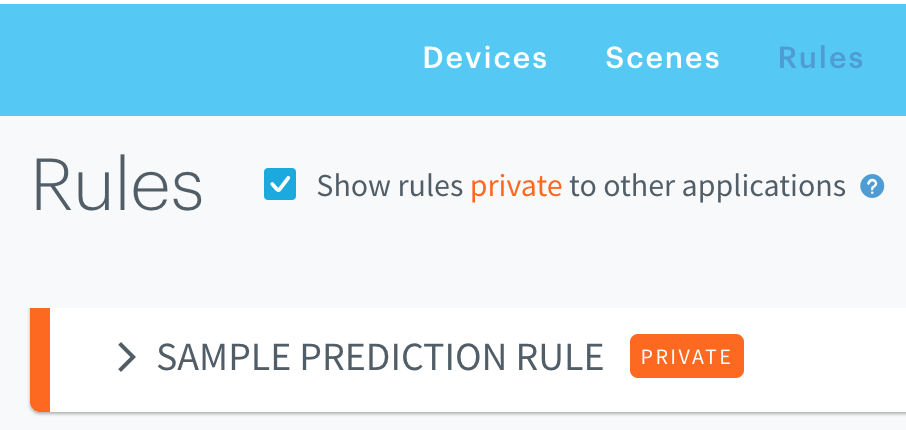

# Add prediction rule to rule engine 

This is an ARTIK cloud services api call sample which creates an prediction rule into your account.   

This sample will demonstrate the following:

* Making an api call to the Rule Engine service endpoint:  `/rules`
* Payload required to create a Rule  

**Prerequisites**

This was run using the following:

* node version >= 9.8.0
* npm version >= 5.8.1

Check your version by typing:

```
%> node --version
v9.8.0
%> npm --version
v5.8.1
```

### Setup / Installation

1. [Create a new device type](https://github.com/artikcloud/sample-json-DeviceTypeManifestsForImport) for this sample (or skip this step if you wish to use an existing device already in your account).  If you wish to create a new device type:  upload the `sample-manifest-smart-lock.json` file to create your manifest.
2. Add a device (of above device type) into your account (or use an existing device already in your account).   Browse your devices and obtain the **device Id* for the device.
3. Log into your application to obtain your **user token** for the application.   If you have not yet created an application, instructions for our oauth2 [Authorization flow is here](https://developer.artik.cloud/documentation/user-management/authentication.html).    Using the user token, you can obtain your **user Id** by calling the `/users/self` api call.  

### **Code setup**

1. Open the sample nodejs script `create-prediction-rule.js` and fill in the information:

```
var your_user_id = 'your_user_id_here';
var your_user_token = 'your_user_token_here';
var your_device_id = 'your_device_id_here';
```

2. This sample will monitor the "state" field from your device.   If you wish to monitor a different field, replace the "state" value to another field you want to monitor:

```
rule_body.rule.if = {
  "field": "state",
  //...
```

3. In this sample, if the predicted value matches the condition you specified, this will trigger the "setOn" action to the device.  If you wish to trigger a different action on the device, replace the "setOn" action to a different value.

Additionally, we set the transformer definition for prediction.   The rule defintion below triggers if the predicted value you defined is true.

```
rule_body.rule.if = {
  "field": "state",
        "operator": "=",
        "operand": {"value": true},
        "transformer": {
            "type": "prediction",
            "parameters": { 
              "predictIn": 3600
             }
        //...
```

4. We will also create this rule so that it is only accessible by this application associated with your user token:

```
"rule": {
    "scope": "thisApplication",   //rule is visible only to this application
    "description": "sample prediction rule"
    //....
}
```

5. Finally install any dependencies by typing:

```
%> npm install
```

###1. Run sample  

Run the script via command line

```
%> node create-prediction-rule.js
```

Here is the successful response data:

```
{
  "data": {
    "uid": "cccc111222333ffffffffffffffffff",
    "id": "c043a0142e5e4975aa5488d59d6a6861",
    "aid": "aaaa111222333ffffffffffffffffff",
    "name": "Sample Prediction Rule",
    "languageVersion": 1,
    "rule": {
      "if": {
        "sdid": "95c2fb05044749b7bf1966be7e0c6237",
        "field": "state",
        "operator": "=",
        "operand": {
          "value": true
        },
        "transformer": {
          "type": "prediction",
          "parameters": { 
            "predictIn": 10
          }
        }
      },
      "then": [
        {
          "ddid": "95c2fb05044749b7bf1966be7e0c6237",
          "action": "setOn",
          "parameters": {}
        }
      ]
    },
    "enabled": true,
    "index": 10,
    "createdOn": 1524702558737,
    "modifiedOn": 1524702558737,
    "isTestable": true,
    "scope": "thisApplication",
    "description": "Sample Prediction Rule",
    "invalidatedOn": 1524702558795,
    "error": {}
  }
}
```

Rule is now active and will trigger the action specified when the prediction value matches the condition you specified.

2. #### View this Rule in your account

You can verify the rule is added to the account by visiting the [Rule Engine dashboard](https://my.artik.cloud).    Click on the checkmark for ("*show private rules* …") to view any additional rules that are only accessible by the application.



### 3. (optional) Send data to the device  

This sample only demontrates creating the Rule into your account.

Test the prediction by sending a message to the device.   If the system matches the prediction rule, it will trigger the action you specified.  

Here are a few options to send a message:

1. Send message to device using the Web Simulator (https://my.artik.cloud -> web device simulator)
2. Send message to device using API Console (https://developer.artik.cloud/api-console)
3. Send message to device using any of our other [Code Samples](https://developer.artik.cloud/documentation/tutorials/code-samples/)

---

## Final notes:

1. The rule engine will only allow 10 rules per user per application.   Attempting to create more will result in the following error:

   ```
   "errors": [{
     "messages": "10 models can be created per app per user. Contact business team if you need more."
     //...
   ```

2. The device must have at least 3 data point for training.    A maximum of the last 30 days of data is used for continuous training.


More about ARTIK cloud services
---------------

If you are not familiar with ARTIK cloud services, we have extensive documentation at https://developer.artik.cloud/documentation

The full ARTIK cloud services API specification can be found at https://developer.artik.cloud/documentation/api-reference/

Peek into advanced sample applications at https://developer.artik.cloud/documentation/tutorials/code-samples/

To create and manage your services and devices on ARTIK cloud services, visit the Developer Dashboard at https://developer.artik.cloud

License and Copyright
---------------------

Licensed under the Apache License. See [LICENSE](LICENSE).

Copyright (c) 2018 Samsung Electronics Co., Ltd.
